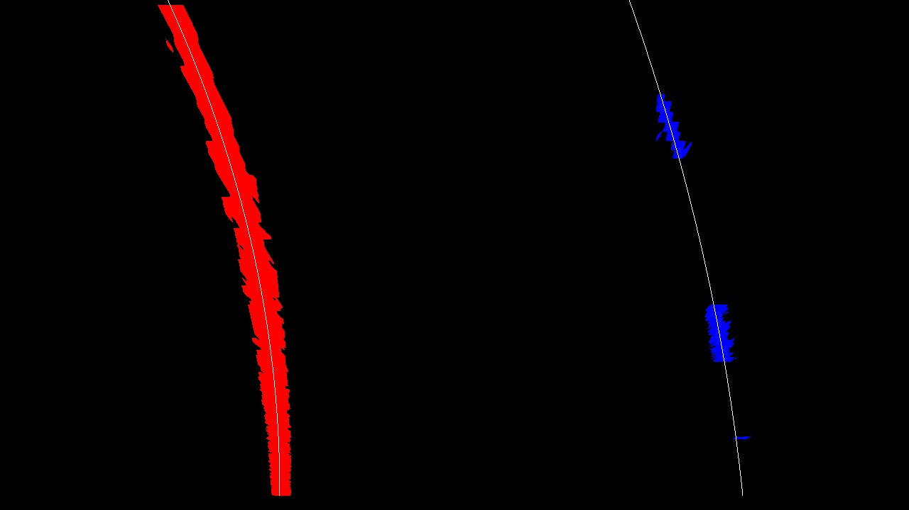
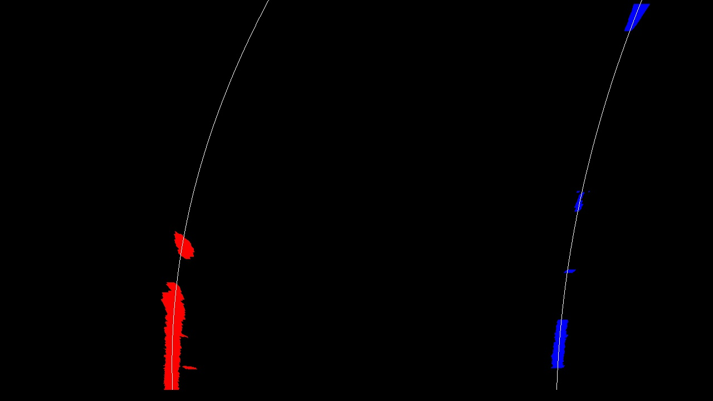

## Report Project 4 Advanced Lane Finding

---

**Advanced Lane Finding Project**

The goals / steps of this project are the following:

* Compute the camera calibration matrix and distortion coefficients given a set of chessboard images.
* Apply a distortion correction to raw images.
* Use color transforms, gradients, etc., to create a thresholded binary image.
* Apply a perspective transform to rectify binary image ("birds-eye view").
* Detect lane pixels and fit to find the lane boundary.
* Determine the curvature of the lane and vehicle position with respect to center.
* Warp the detected lane boundaries back onto the original image.
* Output visual display of the lane boundaries and numerical estimation of lane curvature and vehicle position.

[video1]: ./output_videos/project_video.mp4 "Video"

### Organization of Report

The code to produce results in this report is in "Advanced_Lane_Detection.ipynb"

---

### 1. Camera Calibration

#### Briefly state how you computed the camera matrix and distortion coefficients. Provide an example of a distortion corrected calibration image.

The code for this step is contained in code cells 1-7 in "Advanced_Lane_Detection.ipynb"

Here I assume that the same camera is used to capture all the provided chessboard images or at least the camera distortion is the same. To improve the calibration accuracy, we try to use as many as possible provided images. 

- We first search for registration points for calibration, which are the corners of the chessboard in the provided images. We mainly the `cv2.findChessboardCorners` for this task with some tweaks explained later this section.

- We then map each of the corners to a point in a rectangular grid. We collect all the corners and the mapped points.
- We then calculate the calibration parameter using `cv2.calibrateCamera` function.
- We then undistort the first image using the calibrated parameters via `cv2.undistort()`

##### Identified corners
The identified corners for the images are depicted below where the image title is the size of the grid identified for this image.

Note that the number of corners in each image is not the same among the provided images, therefore, we try to repeatedly apply cv2.findChessboardCorners with different grid sizes, according to the following order [(9,6), (9,5), (8,6), (8,5), (7,6), (7,5), (6,6), (5,6)], and will return the corners the first time that cv2.findChessboardCorners is able to find them.

##### Undistorted image
The test image and the undistorted version are shown below:

### 2. Pipeline (single image)

We use the following image as the example for the pipeline. Towards the end, we will provide the image on all other test images. 

#### 1 Provide an example of a distortion-corrected image.

We apply the calibratoin using the distortion coefficient obtained from section 1 to the example image. This is in code cell 9 where the fuction `pipline_undistort` is from code cell 6 and 7

#### 2. Describe how (and identify where in your code) you used color transforms, gradients or other methods to create a thresholded binary image.  Provide an example of a binary image result.

We calculate magnitude, gradient magnitude and direction for B channel of LUB and L channel of LUV, use thresholding to obtain the binary image. The function is `lane_pixel_detection` (cell 11), which uses `single_color_lane_detection`, `dir_abs_gradient_thresh` and `mag_gradient_thresh` (cell 11). 
The image we obtained is

To be more precise, we apply the following steps:
1. Convert the image to LUB color space and take channel B; also convert the image to LUV color space and take channel L.
2. Use thresholding on magnitude of the color channel to obtain image B1, and L1
3. Use thresholding on gradient magnitudes and graident direction to detect edges and obntain binary image B2, L2 
4. Take "or" operation on B1 and B2 to obtain B3, and L1, L2 to obtain L3.
5. The final image is obtained from the "or" operation on B3 and L3.

The steps are illustrated in the following image: The first row is the corresponding color channel (B of LAB) and (L of LUV), and the second row are the binary images, in which the blue color is B1(L1) and cyan color is B2(L2). 

| B Channel | L Channel |
|:----------|:----------|
| | |
| | |

The color space was selected to detect the yellow line (B channel) and white line (S channel). These two color channels also have the least sensitivity to shadows. See an example below with shadows:

#### 3. Describe how (and identify where in your code) you performed a perspective transform and provide an example of a transformed image.

To apply perspective transform, we need to complete the following two steps:

- Obtain the matrix for perspective transform from the 'straing lines 1' image. (code cell 13-15)
- Apply the same perspective transform to new images. (code cell 16)

##### 3.1 Obtain perspective transform 

To calculate the perspective transform matrix, we apply `cv2.getPerspectiveTransform` which requires us to identify source and destination point sets, i.e., 4 points the original image and their location in the warped image. 

To obtain the 4 points in the original image, we find the location of the two straight lanes in "straing_lines_1.jpg". We use the basic lane detection algorithm in project 1 and then manually adjust the source point so that they match matter with the lanes. 

To obtain the destination points, we keep the x locations of the two lanes on the bottom of the image, and change shrink their distance by a delta = 100 pixels so that these two lanes after transform are approximately centered on the left and right halves of the image. 

We then calculate the transformation matrix `M_perspective_transform` using `cv2.getPerspectiveTransform`. 

The calculated source and destination points are:

| Source        | Destination   | 
|:-------------:|:-------------:| 
| 524, 500      | 336, 450      | 
| 763, 500      | 971, 450     |
| 236, 700      | 336, 700      |
| 1071, 700     | 971, 700     |

##### 3.2 Apply perspective transform 
We apply the perspective transform using the matrix obtained from the above procedure to the binary images. Note that in writing this report, I use apply the transform to the same image 'straing lines 1'. In section 3, I applied the **same** perspective transform to other images.

The obtained binary image after the perspective transform are below

#### 4. Describe how (and identify where in your code) you identified lane-line pixels and fit their positions with a polynomial?

This is done in 3 steps:
1. We obtain a restricted search area for lane pixels: This is done in function `get_lane_pixel_mask` in cell 19 when there is no prior information. See section search region for details. 
2. Only keep the non-zero values in the restricted search area, and output their x,y indices. `get_pixel_index` in cell 19.
3. Fit a polynomial to the x, y indices of the pixels using robust regression. The function is `calc_curvature` in cell 22.

The result from is step is depicted in 

The red and blue are the pixels covered by the search area. 

##### search area
To calculate the serach area, we first convolute the image with a 2D one-valued arrays of size 21 x 61. We then apply a y grid with step size 21. After this, starting from the bottom of the image, for each y, we find the pixel with the highest value per y location in the left and right half of the image. These are the center points of search windows of size 21x61. 

In the case of a video, if a lane has been identified in previous frame, we then use the lane pixels as the center of search windows. The search area would be shifting the lane pixels to the left and right by 30 on each direction. 

##### lane fitting

We fit the quadratic polynomial to the pxiels on the left and right based on the following formula:
$$ x = Ay^2 + By + C$$ 
where $x$ and $y$ are of unit meters and converted from x and y pixel poistion by the pixel-to-distance raio: ym_per_pix = 3/90, xm_per_pix =  3.7/635.

We apply a robust regression using iterative re-weighted least-squares to reduce the impact of outlier pixels. 

#### 5. Describe how (and identify where in your code) you calculated the radius of curvature of the lane and the position of the vehicle with respect to center.

The radius of curvature and vehicle position calculation is also done in function `calc_curvature` defined in code cell 22.

I convert the x, y value of pixels to real world distances using ym_per_pix and xm_per_pix in code cell 32. We use the coefficient from the regression to calculate the radius of curvature in the following code
$$R_{curve} = \frac{(1+(2Ay+B)^2)^{3/2}}{|2A|}$$

The position calculated by comparing the center of the image to the lane's x location at y = 700 pixels.
car_position is calculated as half image width minus average of left lane x and right lane x location at y=700.

#### 6. Provide an example image of your result plotted back down onto the road such that the lane area is identified clearly.

I implemented this step in `mark_unwarped_lane` in code cell 24. 

### Pipeline (multiple image)

I define the pipeline `pipeline` defined in code cell 72 that captures the above steps and applied to all test images. The results are below:

| Straight_line_2 |
|:----------|
| |

| Test 1 |
|:----------|
| |

| Test 2 |
|:----------|
| |

| Test 3 |
|:----------|
| |

| Test 4 |
|:----------|
| |

| Test 5 |
|:----------|
| |

| Test 6 |
|:----------|
| |

The intermediate images are displayed below:

|Original |Binary |
|:----------|:----------|
| | |
|Warped |Lanes |
| | | 

|Original |Binary |
|:----------|:----------|
| | |
|Warped |Lanes |
| | | 

|Original |Binary |
|:----------|:----------|
| | |
|Warped |Lanes |
| | | 

|Original |Binary |
|:----------|:----------|
| | |
|Warped |Lanes |
| | | 

|Original |Binary |
|:----------|:----------|
| | |
|Warped |Lanes |
| | | 

|Original |Binary |
|:----------|:----------|
| | |
|Warped |Lanes |
| | | 

|Original |Binary |
|:----------|:----------|
| | |
|Warped |Lanes |
| | | 

---

### Pipeline (video)

#### 1. Provide a link to your final video output.  Your pipeline should perform reasonably well on the entire project video (wobbly lines are ok but no catastrophic failures that would cause the car to drive off the road!).

Here's a [link to my video result](./output_videos/project_video.mp4)
<video controls src="./output_videos/project_video.mp4" />

For the video, we apply the following techniques to leverage the continuity of images across frames:

- We keep track the best estimate of left lanes and right lanes, and  update them with the recent image using an exponential average rule with alpha = 0.2.
- To search for lanes in the new frame, we use the best estimated lanes to from the search area: The search area is formed by shifting each lane left and right by 30 pixels and using the area in between. 
- We check the curvature and slope of left and right lanes estimated from the current image, and reject them if the difference is too large. In the case of rejection of current estimate, we do not update the lanes. 
- The marked lanes in the image are from the best estimate.

---

### Discussion

#### 1. Briefly discuss any problems / issues you faced in your implementation of this project.  Where will your pipeline likely fail?  What could you do to make it more robust?

The main issue with the implementation is the curvature calculation: Let's examine the equation for the curvature:
$$R_{curve} = \frac{(1+(2Ay+B)^2)^{3/2}}{|2A|}$$
We note that this calculate is very sensitive to errrors in $A$ due to its role in the demoninator. On the other hand, the regression problem suffers from multicollinearity which makese it difficult to obtain a reliable estimate of $A$. To solve this issue, I would consider 
- reparameterization of the regression equation using the $R_{curve}$ parameter.
- regulerization in parameter estimate
- combine data from multiple frames

The second issue is the selection of perspective transform in which we decide how much of the lanes are covered in the unwarped image. By changing the specified y value of the corner points, we could include more or less farther-away portions of the lanes (pixels near the top of the image) But notice that the image noise and error in perspective transform is magnified for those pixels. This might be partly mitigated by performing a weighted regression instead of Ordinary Least Squares regression. 

The third issue is to address the case when the car goes through a bump. In this case, the previous calculated perspective transform no longer the correct one. Moreover, the smoothed lanes no longer applies. To make it robust, we could consider adjust the perspective transform in real time. 
